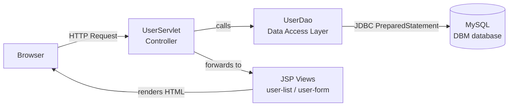

<div align="center">

# 👥 User Management Web Application

### A full-stack CRUD web app built with **JSP, Servlets & MySQL**

[](https://www.java.com/)
[](https://projects.eclipse.org/projects/ee4j.jsp)
[](https://projects.eclipse.org/projects/ee4j.servlet)
[](https://www.mysql.com/)
[](https://maven.apache.org/)
[](https://getbootstrap.com/)

[](LICENSE)


**A classic MVC-style Java web application that lets you Create, Read, Update, and Delete user records — complete with form validation, duplicate-email checks, and a clean Bootstrap UI.**

[Features](#-features) •
[Architecture](#-architecture) •
[Getting Started](#-getting-started) •
[Database Setup](#-database-setup) •
[Routes](#-routes--endpoints) •
[Project Structure](#-project-structure) •
[Roadmap](#-roadmap)

</div>

---

## 📖 About the Project

The **User Management Web Application** is a server-rendered Java web app demonstrating the classic **JSP + Servlet + DAO** architecture (no Spring, no frameworks — just core Java EE). It manages a list of users, each linked to a **class/course**, and supports full CRUD functionality through a Bootstrap-styled interface.

> 💡 A solid example of the traditional **MVC pattern** in Java web development: Servlets as controllers, JSP as views, and a DAO layer talking to MySQL via JDBC with `PreparedStatement` (SQL-injection safe by design).

---

## ✨ Features

| # | Feature | Description |
|---|----------|-------------|
| ➕ | **Add User** | Create a new user with name, father's name, phone, email, country & class |
| 📋 | **List Users** | View all users in a responsive Bootstrap table |
| ✏️ | **Edit User** | Update any user's details, pre-filled in the form |
| 🗑️ | **Delete User** | Remove a user with a JS confirmation prompt |
| 📧 | **Duplicate Email Check** | Prevents inserting a user with an email that already exists |
| 🎓 | **Class/Course Linking** | Users are associated with a class via a foreign key (`class_id`) |
| 🛡️ | **SQL Injection Safe** | All queries use `PreparedStatement` — no raw string concatenation |
| ⚠️ | **Custom Error Page** | Friendly error page for uncaught exceptions |

---

## 🏗️ Architecture

This project follows the classic **MVC + DAO** pattern used in traditional Java EE apps:



| Layer | Class/File | Responsibility |
|-------|------------|-----------------|
| **Model** | `User.java`, `Classes.java` | Plain Java objects representing data |
| **DAO** | `UserDao.java` | All database operations (insert, select, update, delete) |
| **Controller** | `UserServlet.java` | Handles HTTP requests, routes actions |
| **View** | `user-list.jsp`, `user-form.jsp`, `Error.jsp` | Renders the UI |

---

## 🛠️ Tech Stack

- **Language:** Java 11
- **Web Layer:** Java Servlets + JSP (Jakarta/Java EE, `javax.servlet` 4.0.1)
- **Templating:** JSTL 1.2
- **Database:** MySQL
- **Connectivity:** JDBC — `mysql-connector-j` 9.2.1
- **Build Tool:** Maven (packaged as `.war`)
- **Frontend:** Bootstrap 4.3.1
- **Server:** Any Servlet container — Apache Tomcat recommended

---

## 🚀 Getting Started

### Prerequisites

- ☕ [JDK 11+](https://www.oracle.com/java/technologies/downloads/)
- 📦 [Maven](https://maven.apache.org/download.cgi)
- 🐬 [MySQL Server](https://dev.mysql.com/downloads/mysql/)
- 🐱 [Apache Tomcat 9+](https://tomcat.apache.org/) (or any Servlet 4.0-compatible container)
- 💻 IntelliJ IDEA / Eclipse (optional, but recommended)

### Installation

1. **Clone the repository**
   ```bash
   git clone https://github.com/<your-username>/User_Management_Web_Application.git
   cd User_Management_Web_Application
   ```

2. **Set up the database** — see [Database Setup](#-database-setup) below

3. **Configure DB credentials**
   Open `src/main/java/usermanagement/dao/UserDao.java` and update if needed:
   ```java
   private String jdbcURL = "jdbc:mysql://localhost:3306/DBM";
   private String jdbcUsername = "root";
   private String jdbcPassword = "1234";
   ```

4. **Build the project with Maven**
   ```bash
   mvn clean package
   ```
   This generates `target/Jsp_Servlet.war`

5. **Deploy to Tomcat**
   - Copy `Jsp_Servlet.war` into Tomcat's `webapps/` folder, **or**
   - Run directly from IntelliJ IDEA / Eclipse using a configured Tomcat server

6. **Open in browser**
   ```
   http://localhost:8080/Jsp_Servlet/
   ```

---

## 🗄️ Database Setup

```sql
CREATE DATABASE IF NOT EXISTS DBM;
USE DBM;

CREATE TABLE class (
    id   INT AUTO_INCREMENT PRIMARY KEY,
    name VARCHAR(100) NOT NULL
);

CREATE TABLE users (
    id          INT AUTO_INCREMENT PRIMARY KEY,
    name        VARCHAR(100) NOT NULL,
    FatherName  VARCHAR(100) NOT NULL,
    phone       VARCHAR(20)  NOT NULL,
    email       VARCHAR(100) NOT NULL UNIQUE,
    country     VARCHAR(100) NOT NULL,
    class_id    INT,
    time_date   TIMESTAMP DEFAULT CURRENT_TIMESTAMP,
    FOREIGN KEY (class_id) REFERENCES class(id)
);

-- Sample classes
INSERT INTO class (name) VALUES ('Computer Science'), ('Business Administration'), ('Software Engineering');
```

---

## 🌐 Routes / Endpoints

| Method | Endpoint | Action |
|--------|----------|--------|
| `GET` | `/` or `/list` | Show all users |
| `GET` | `/new` | Show "Add User" form |
| `POST` | `/insert` | Insert a new user |
| `GET` | `/edit?id={id}` | Show "Edit User" form, pre-filled |
| `POST` | `/update` | Update an existing user |
| `GET` | `/delete?id={id}` | Delete a user |

---

## 📂 Project Structure

```
User_Management_Web_Application/
├── pom.xml                                 # Maven build configuration
└── src/main/
    ├── java/usermanagement/
    │   ├── model/
    │   │   ├── User.java                   # User entity
    │   │   └── Classes.java                # Class/course entity
    │   ├── dao/
    │   │   └── UserDao.java                 # JDBC data access layer
    │   └── web/
    │       └── UserServlet.java             # Controller — handles all routes
    ├── resources/
    │   └── bootstrap-4.3.1-dist/             # Bootstrap assets
    └── webapp/
        ├── WEB-INF/
        │   ├── web.xml                       # Servlet mappings
        │   └── lib/                          # JSTL & MySQL connector jars
        ├── user-list.jsp                     # User list view
        ├── user-form.jsp                     # Add/Edit form view
        └── Error.jsp                         # Custom error page
```

---

## 🧩 Roadmap / Future Improvements

- [ ] Migrate to **Spring Boot** for a more modern architecture
- [ ] Add **client-side validation** (JS) alongside server-side checks
- [ ] Add **pagination & search** to the user list
- [ ] Add **authentication/authorization** (login, roles)
- [ ] Add **REST API** layer (JSON responses) for frontend frameworks
- [ ] Write **unit tests** for `UserDao` (JUnit 5 is already a dependency)
- [ ] Use a **connection pool** (e.g., HikariCP) instead of a new connection per query
- [ ] Move DB credentials to a properties/config file or environment variables

> Contributions and suggestions are welcome — feel free to open an issue or PR! 🙌

---

## 🤝 Contributing

1. Fork the repo
2. Create your feature branch (`git checkout -b feature/amazing-feature`)
3. Commit your changes (`git commit -m 'Add some amazing feature'`)
4. Push to the branch (`git push origin feature/amazing-feature`)
5. Open a Pull Request

---

## 📄 License

This project is licensed under the **MIT License** — feel free to use, modify, and distribute it.

---

## 👤 Author

**Deepak**
🔗 [GitHub](https://github.com/DeepakGir) • [LinkedIn](https://linkedin.com/in/your-profile)

---

<div align="center">

⭐ If you found this project useful, consider giving it a **star** — it helps a lot!

</div>
