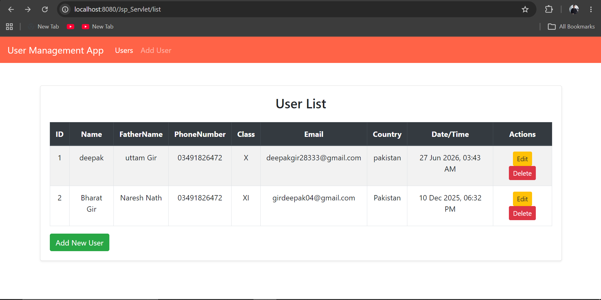
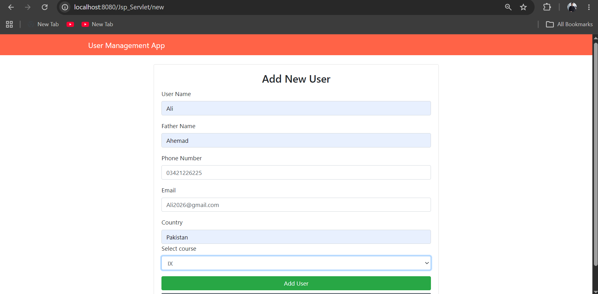
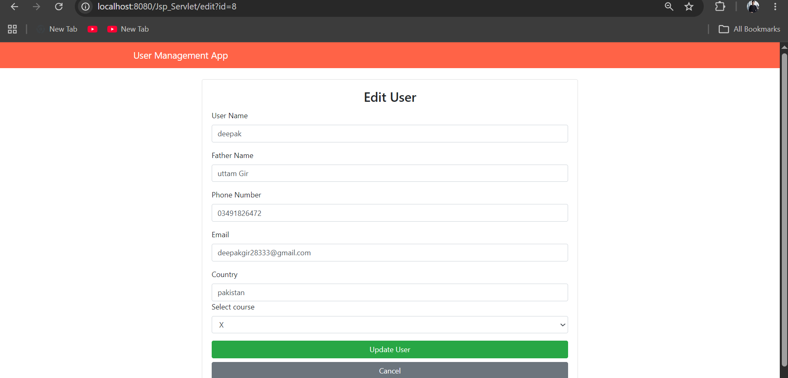
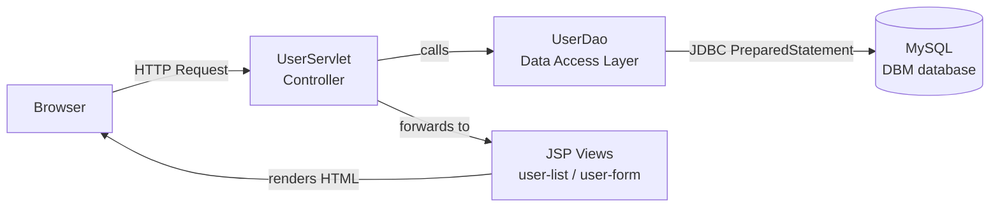

<div align="center">

# 👥 User Management Web Application

### A full-stack CRUD web app built with **JSP, Servlets & MySQL**

[](https://www.java.com/)
[](https://projects.eclipse.org/projects/ee4j.jsp)
[](https://projects.eclipse.org/projects/ee4j.servlet)
[](https://www.mysql.com/)
[](https://maven.apache.org/)
[](https://getbootstrap.com/)

[](LICENSE)


**A classic MVC-style Java web application that lets you Create, Read, Update, and Delete user records — complete with form validation, duplicate-email checks, and a clean Bootstrap UI.**

[Features](#-features) •
[Architecture](#-architecture) •
[Getting Started](#-getting-started) •
[Database Setup](#-database-setup) •
[Routes](#-routes--endpoints) •
[Project Structure](#-project-structure) •
[Roadmap](#-roadmap)

</div>

## 📌 About The Project

**User Management Web Application** is a Java-based CRUD web application designed to manage user/student records through a clean and responsive web interface.

The application allows administrators or users to:

* ➕ Add new users
* 👀 View all users
* ✏️ Edit existing users
* 🗑️ Delete users
* 🔍 Manage user information
* 📚 Assign users to classes/courses
* 📧 Prevent duplicate email registration
* 🕒 Store and display record creation/update date and time
* 📱 Use the application on desktop and mobile screens

The project follows a layered structure using:

**JSP → Servlet → DAO → JDBC → MySQL**

This makes the project a good practical example for learning **Java Web Development, MVC concepts, JDBC, Servlets, JSP and CRUD operations**.

---

## ✨ Features

### 👤 User Management

| Feature             | Description                          |
| ------------------- | ------------------------------------ |
| ➕ Add User          | Create a new user record             |
| 📋 View Users       | Display all registered users         |
| ✏️ Edit User        | Update existing user information     |
| 🗑️ Delete User     | Remove a user from the database      |
| 📧 Email Validation | Prevent duplicate email addresses    |
| 📚 Class Selection  | Assign a user to a class/course      |
| 🕒 Date & Time      | Track record date and time           |
| 📱 Responsive UI    | Bootstrap-based responsive interface |
| ⚠️ Error Handling   | Display application/database errors  |

---

## 🖥️ Application Preview

> Add your actual screenshots inside the `screenshots` folder.

### 👥 User List



### ➕ Add User



### ✏️ Edit User




## 🎨 User Interface

The application uses **Bootstrap 4.3.1** to provide a clean and responsive interface.

### Main Pages

* **User List Page**
* **Add User Page**
* **Edit User Page**
* **Error Page**

The navigation provides quick access to:

* Users
* Add User

---

## 🛠️ Technology Stack

### Backend

* ☕ **Java 11**
* 🌐 **Java Servlet API 4.0.1**
* 📄 **JSP 2.3.3**
* 🔗 **JDBC**
* 🗃️ **MySQL**
* 📦 **Maven**

### Frontend

* HTML5
* CSS3
* Bootstrap 4.3.1
* JSP

### Server

* Apache Tomcat
* Java Web Application / WAR

### Database

* MySQL
* JDBC MySQL Connector

---

## 🏗️ Application Architecture


This project follows the classic **MVC + DAO** pattern used in traditional Java EE apps:





| Layer | Class/File | Responsibility |

|-------|------------|-----------------|

| **Model** | `User.java`, `Classes.java` | Plain Java objects representing data |

| **DAO** | `UserDao.java` | All database operations (insert, select, update, delete) |

| **Controller** | `UserServlet.java` | Handles HTTP requests, routes actions |

| **View** | `user-list.jsp`, `user-form.jsp`, `Error.jsp` | Renders the UI |


---


# 📂 Project Structure

```text
User_Management_Web_Application/
│
├── src/
│   └── main/
│       │
│       ├── java/
│       │   └── usermanagement/
│       │       │
│       │       ├── dao/
│       │       │   └── UserDao.java
│       │       │
│       │       ├── model/
│       │       │   ├── User.java
│       │       │   └── Classes.java
│       │       │
│       │       └── web/
│       │           └── UserServlet.java
│       │
│       └── webapp/
│           │
│           ├── bootstrap-4.3.1-dist/
│           │
│           ├── WEB-INF/
│           │   ├── lib/
│           │   └── web.xml
│           │
│           ├── user-list.jsp
│           ├── user-form.jsp
│           └── Error.jsp
│
├── pom.xml
├── .gitignore
└── README.md
```

---

# 🔄 CRUD Workflow

The application implements complete CRUD functionality.

```text
                    USER MANAGEMENT
                           │
          ┌────────────────┼────────────────┐
          │                │                │
          ▼                ▼                ▼
       CREATE            READ             UPDATE
          │                │                │
          ▼                ▼                ▼
      Add User         User List        Edit User
          │                │                │
          └────────────────┼────────────────┘
                           │
                           ▼
                         DELETE
                           │
                           ▼
                      Delete User
```

---

# ➕ Add User

Users can be added through the **Add User** form.

The form collects:

* User Name
* Father Name
* Phone Number
* Email
* Country
* Class/Course

Example flow:

```text
Add User
   ↓
Fill Form
   ↓
Validate Email
   ↓
Insert Into MySQL
   ↓
Redirect To User List
```

If the email already exists, the application displays:

```text
⚠️ Email already exists!
```

---

# 👀 View Users

The User List displays:

* Serial Number
* Name
* Father Name
* Phone Number
* Class
* Email
* Country
* Date/Time
* Edit
* Delete

The list is retrieved from MySQL using JDBC and displayed through JSP.

---

# ✏️ Edit User

Existing users can be edited using the **Edit** button.

```text
User List
    ↓
Edit
    ↓
Load Existing User
    ↓
Modify Information
    ↓
Update Database
    ↓
Return To User List
```

---

# 🗑️ Delete User

Users can be deleted using the **Delete** button.

A confirmation dialog is displayed before deletion:

```text
Are you sure?
```

After confirmation, the selected user is removed from MySQL.

---

# 📚 Class Management

The application also supports assigning users to classes/courses.

Classes are retrieved from the database and displayed dynamically inside the user form.

```text
MySQL
  │
  ▼
class table
  │
  ▼
UserDao
  │
  ▼
UserServlet
  │
  ▼
user-form.jsp
  │
  ▼
Select Course
```

---

# 🗄️ Database

The project uses **MySQL**.

### Database Name

```sql
DBM
```

### Main Tables

```text
DBM
│
├── users
│
└── class
```

### Users Table

The `users` table stores information such as:

```text
id
name
FatherName
phone
email
country
class_id
time_date
```

### Class Table

The `class` table stores:

```text
id
name
```

### Relationship

```text
class
  │
  │ 1
  │
  │
  │ *
  ▼
users
```

A user belongs to a selected class through:

```text
users.class_id → class.id
```

---

# 💾 Database Setup

Create the database:

```sql
CREATE DATABASE IF NOT EXISTS DBM;

USE DBM;
```

Create the class table:

```sql
CREATE TABLE class (
    id INT AUTO_INCREMENT PRIMARY KEY,
    name VARCHAR(255) NOT NULL
);
```

Example classes:

```sql
INSERT INTO class (name)
VALUES
('Java'),
('Web Development'),
('Database'),
('Python');
```

Create the users table:

```sql
CREATE TABLE users (
    id INT AUTO_INCREMENT PRIMARY KEY,
    name VARCHAR(255) NOT NULL,
    FatherName VARCHAR(255) NOT NULL,
    phone VARCHAR(50) NOT NULL,
    email VARCHAR(255) NOT NULL UNIQUE,
    country VARCHAR(255) NOT NULL,
    class_id INT,
    time_date TIMESTAMP DEFAULT CURRENT_TIMESTAMP,
    FOREIGN KEY (class_id) REFERENCES class(id)
);
```

> **Important:** Update the database username and password in `UserDao.java` according to your local MySQL configuration.

---

# ⚙️ Database Configuration

The current DAO uses:

```java
private String jdbcURL = "jdbc:mysql://localhost:3306/DBM";
private String jdbcUsername = "root";
private String jdbcPassword = "1234";
```

Change these values if your MySQL setup is different:

```java
private String jdbcUsername = "root";
private String jdbcPassword = "YOUR_PASSWORD";
```

### Recommended

For a real production application, database credentials should **not be hard-coded** inside Java source code.

Instead, use:

* Environment variables
* Configuration files
* Secrets management

---

# 🚀 Getting Started

Follow these steps to run the project locally.

## 1️⃣ Prerequisites

Make sure you have installed:

* Java JDK 11+
* Apache Maven
* MySQL Server
* Apache Tomcat
* IntelliJ IDEA / Eclipse / another Java IDE
* Git

Check Java:

```bash
java -version
```

Check Maven:

```bash
mvn -version
```

---

## 2️⃣ Clone Repository

```bash
git clone https://github.com/DeepakGir/User_Management_Web_Application.git
```

Move into the project:

```bash
cd User_Management_Web_Application
```

---

## 3️⃣ Configure MySQL

Start MySQL and create the database:

```sql
CREATE DATABASE DBM;
```

Then create the required tables using the SQL commands provided above.

---

## 4️⃣ Configure Database Credentials

Open:

```text
src/main/java/usermanagement/dao/UserDao.java
```

Update:

```java
private String jdbcURL = "jdbc:mysql://localhost:3306/DBM";
private String jdbcUsername = "root";
private String jdbcPassword = "YOUR_PASSWORD";
```

---

## 5️⃣ Build With Maven

Run:

```bash
mvn clean package
```

After a successful build, Maven generates the WAR file inside:

```text
target/
```

Example:

```text
target/Jsp_Servlet.war
```

---

# 🐱 Running With Apache Tomcat

Deploy the generated WAR file to Tomcat.

```text
target/Jsp_Servlet.war
        ↓
Tomcat/webapps/
        ↓
Start Tomcat
```

Then open the application in your browser.

```text
http://localhost:8080/Jsp_Servlet/list
```

---

# 🔗 Application Routes

| Route         | Method | Purpose             |
| ------------- | ------ | ------------------- |
| `/list`       | GET    | Display all users   |
| `/new`        | GET    | Open Add User form  |
| `/insert`     | POST   | Insert new user     |
| `/edit?id=`   | GET    | Open Edit User form |
| `/update`     | POST   | Update user         |
| `/delete?id=` | GET    | Delete user         |

### Examples

```text
/list
```

```text
/new
```

```text
/edit?id=1
```

```text
/delete?id=1
```

---

# 🔐 Data Validation

The application includes basic validation such as:

* Required form fields
* HTML email validation
* Duplicate email checking
* Prepared SQL statements
* Confirmation before deletion

Prepared statements are used for database queries:

```java
PreparedStatement ps =
    conn.prepareStatement(INSERT_USERS_SQL);
```

This helps reduce the risk of SQL injection compared with directly concatenating user input into SQL queries.

---

# 🧩 Important Java Components

## `UserServlet.java`

Acts as the main controller.

It handles:

```text
/new
/insert
/list
/edit
/update
/delete
```

---

## `UserDao.java`

Responsible for database operations:

```text
insertUser()
selectUser()
selectAllUsers()
updateUser()
deleteUser()
isEmailExists()
fetch_all_classes()
```

---

## `User.java`

Represents a user entity containing:

```text
id
name
FatherName
phone
email
country
classId
className
time_date
```

---

## `Classes.java`

Represents class/course information:

```text
id
name
```

---

## JSP Pages

### `user-list.jsp`

Displays all users in a responsive Bootstrap table.

### `user-form.jsp`

Used for:

```text
Add User
Edit User
```

### `Error.jsp`

Displays application errors.

---

# 📦 Maven Dependencies

The project uses Maven for dependency management.

Main dependencies include:

```text
Java Servlet API 4.0.1
JSP API 2.3.3
JSTL 1.2
MySQL Connector
JUnit 5
```

Build plugins include:

```text
Maven Compiler Plugin
Maven WAR Plugin
Maven Surefire Plugin
```

---

# 🎨 Frontend

The project uses **Bootstrap 4.3.1** for:

* Responsive layout
* Navigation bar
* Forms
* Buttons
* Tables
* Cards
* Alerts
* Mobile-friendly design

The Bootstrap files are included locally inside:

```text
src/main/webapp/bootstrap-4.3.1-dist/
```

Therefore, the interface can use Bootstrap without depending on an external CDN.

---

# 📱 Responsive Design

The application includes:

```html
<meta name="viewport"
      content="width=device-width, initial-scale=1.0">
```

and Bootstrap responsive classes such as:

```text
container
table-responsive
col-md-6
navbar-expand-md
btn-block
```

This allows the application to adapt to different screen sizes.

---

# 🧠 What I Learned From This Project

This project demonstrates practical knowledge of:

* Java Web Development
* Java Servlets
* JSP
* JDBC
* MySQL
* Maven
* CRUD Operations
* MVC-style architecture
* DAO Pattern
* Prepared Statements
* HTTP GET/POST
* RequestDispatcher
* Form handling
* Database relationships
* Bootstrap responsive design
* Error handling
* WAR deployment
* Apache Tomcat

---

# 🔮 Future Improvements

Possible improvements for future versions:

* 🔐 User authentication and login
* 👮 Role-based access control
* 🔎 Search users
* 📊 Dashboard with statistics
* 📄 Pagination
* 🔃 Sorting and filtering
* 📥 Export users to Excel/PDF
* 📸 User profile images
* 🔑 Password encryption
* 🌐 REST API integration
* 📝 Server-side form validation
* 🔒 Environment-based database configuration
* 🧪 More automated tests
* 📱 Improved mobile UI
* ☁️ Cloud deployment

---

# 🛡️ Security Improvements

For production use, the following improvements are recommended:

### Database Credentials

Move credentials outside source code.

### Authentication

Add secure login and session management.

### Authorization

Implement role-based access:

```text
Admin
Teacher
User
```

### Input Validation

Add server-side validation for:

* Name
* Phone
* Email
* Country

### CSRF Protection

Protect POST requests against CSRF attacks.

### Password Security

If authentication is added, passwords should be securely hashed rather than stored as plain text.

---

# 📸 Recommended GitHub Screenshots

Create this folder:

```text
screenshots/
```

Recommended files:

```text
screenshots/
├── user-list.png
├── add-user.png
├── edit-user.png
└── responsive.png
```

Then the README will automatically display them using:


```

> Make sure the image names in the README exactly match the actual filenames.

---

# 🧪 Testing Checklist

Before deploying the application, test:

```text
☑ Database connection
☑ Add user
☑ Duplicate email
☑ Display users
☑ Edit user
☑ Delete user
☑ Class selection
☑ Required fields
☑ Invalid email
☑ Responsive layout
☑ Error page
☑ Tomcat deployment
```

---

# 📊 Project Flow

```text
                    ┌───────────────┐
                    │    Browser    │
                    └───────┬───────┘
                            │
                            ▼
                    ┌───────────────┐
                    │      JSP      │
                    └───────┬───────┘
                            │
                            ▼
                    ┌───────────────┐
                    │   Servlet     │
                    │ UserServlet   │
                    └───────┬───────┘
                            │
                            ▼
                    ┌───────────────┐
                    │     DAO       │
                    │   UserDao     │
                    └───────┬───────┘
                            │
                            ▼
                    ┌───────────────┐
                    │     JDBC      │
                    └───────┬───────┘
                            │
                            ▼
                    ┌───────────────┐
                    │    MySQL      │
                    │      DBM      │
                    └───────────────┘
```

---

# 💻 Example User Record

```text
Name        : John Doe
Father Name : Robert Doe
Phone       : 03001234567
Email       : john@example.com
Country     : Pakistan
Class       : Java
Date/Time   : 11 Aug 2026, 02:00 AM
```

---

# 📈 Project Highlights

```text
✅ Complete CRUD Application
✅ Java Servlet Backend
✅ JSP Frontend
✅ JDBC Database Connectivity
✅ MySQL Database
✅ DAO Pattern
✅ Class/User Relationship
✅ Duplicate Email Detection
✅ Bootstrap Responsive UI
✅ Maven Project
✅ Apache Tomcat Deployment
✅ Prepared Statements
```

---

# 🤝 Contributing

Contributions are welcome.

1. Fork the repository
2. Create a new branch

```bash
git checkout -b feature/your-feature
```

3. Make your changes
4. Commit your changes

```bash
git add .
git commit -m "Add new feature"
```

5. Push the branch

```bash
git push origin feature/your-feature
```

6. Open a Pull Request

---

# 📝 License

This project is created for **educational and portfolio purposes**.

You are free to study, modify and improve the project.

---

# 👨‍💻 Author

## Deepak Gir

**Computer Science Student | Java & Web Developer**

### Technologies

```text
Java
JSP
Servlet
JDBC
MySQL
HTML
CSS
JavaScript
Bootstrap
Maven
Git & GitHub
```

### Connect With Me

<p>
  <a href="https://github.com/DeepakGir">
    
  </a>
</p>

---

# ⭐ Support

If you found this project useful:

⭐ **Star this repository**

🍴 **Fork the repository**

🐛 **Report issues**

💡 **Suggest improvements**

---

<p align="center">

### 🚀 Built with Java, JSP, Servlet, JDBC & MySQL

**Made with ❤️ for learning and building real-world Java applications.**

</p>
